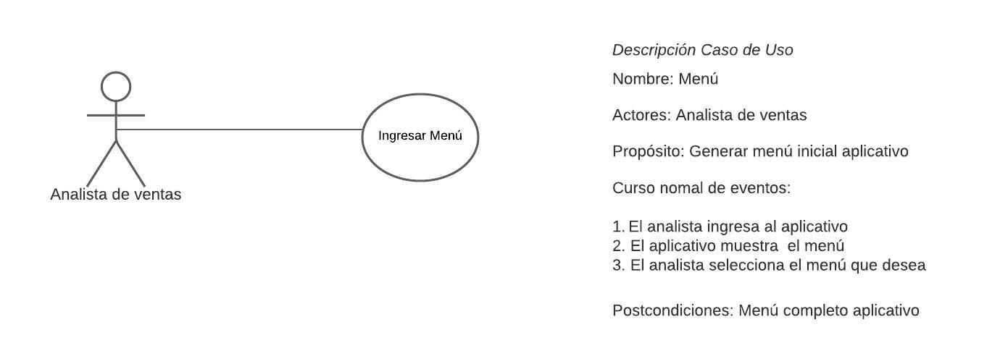
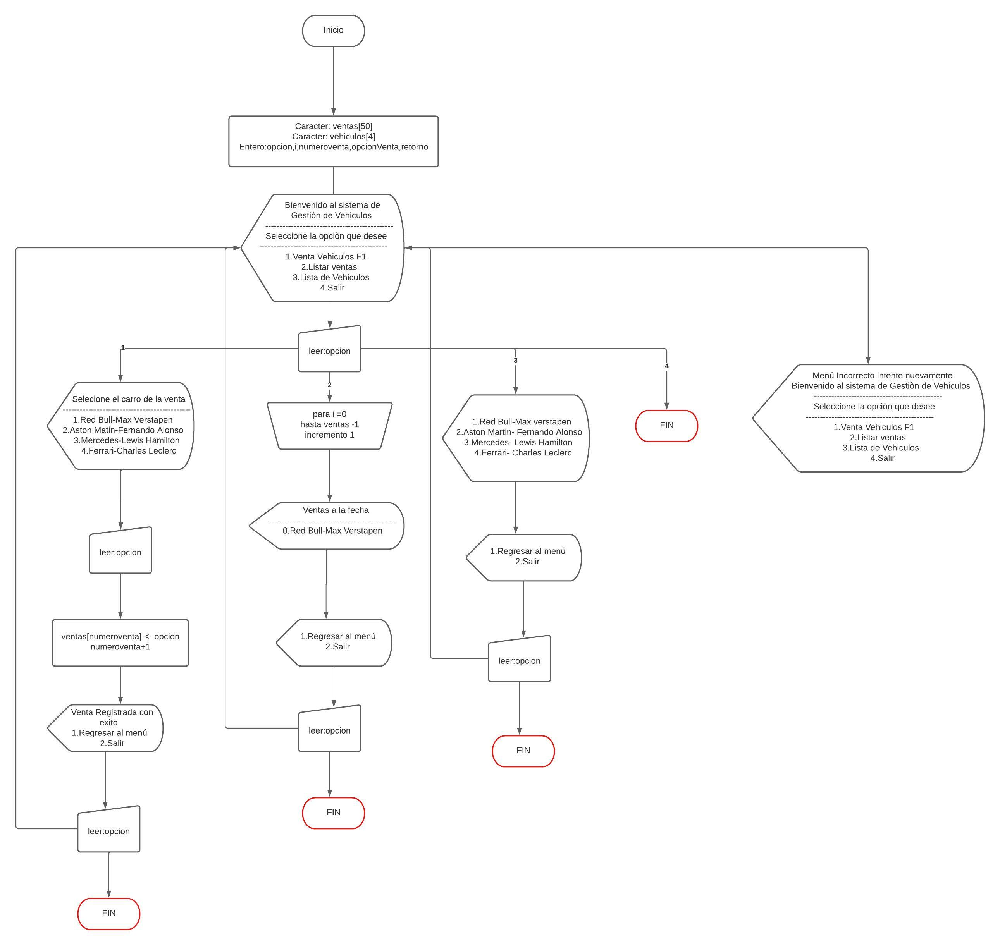

# Ventas de vehiculos F1
## Venta vehiculos
### <sub> En su labor como programador de software es necesaria una aplicación que gestione la venta de vehiculos selectos de la formula 1, donde venda, administre y gestione el inventario de venta de estos vehiculos dando como resultado informes necesarios para la compañia.</sub>

> Aclaraciones
+ Se supondra que el aplicativo solo requiere para ver la gestión y administración de una venta de la compañia
+ Para efectos de mantener la simplicidad del ejemplo no se comtemplan manejar persistencia en el almacenamiento de los datos
+ No se realiza valdación, ni se verifica calidad en los dato ingresados
+ No se validara las existencias o compras recurrentes en el aplicativo

## Historia de Usuario
> HU_01_Menu_Inicial

> HU_02_Venta_Vehiculo

> HU_03_Listar_Venta

> HU_04_Listar_Vehiculos

#
## Casos de Uso
> HU_01_Menu_Inicial

> HU_02_Venta_Vehiculo

> HU_03_Listar_Venta

> HU_04_Listar_Vehiculos

#
## Diagrama de Flujo

#
## Psudocodigo
```
Algoritmo VentaVehiculo
    // Declaración de variables
    arreglo ventas[50]
    arreglo vehiculos[4]
    entero opcion, numeroventa = 0, opcionVenta, retorno = 0
    
    hacer {
        escribir("Bienvenido al sistema de Gestión de Vehiculos")
        escribir("---------------------------------------------")
        escribir("Seleccione la opción que desee")
        escribir("---------------------------------------------")
        escribir("1. Venta Vehículos F1")
        escribir("2. Listar ventas")
        escribir("3. Lista de Vehículos")
        escribir("4. Salir")
        opcion = sc.leerEntero()
        
        si(opcion >= 1 y opcion <=4) entonces
            seleccionar(opcion) hacer
                caso 1:
                    escribir("Seleccione el carro de la venta")
                    escribir("---------------------------------------------")
                    escribir("1. Red Bull-Max Verstapen")
                    escribir("2. Aston Matin-Fernando Alonso")
                    escribir("3. Mercedes-Lewis Hamilton")
                    escribir("4. Ferrari-Charles Leclerc")
                    opcionVenta = sc.leerEntero()
                    
                    seleccionar(opcionVenta) hacer
                        caso 1:
                            ventas[numeroventa] = "Red Bull-Max Verstapen"
                        caso 2:
                            ventas[numeroventa] = "Aston Matin-Fernando Alonso"
                        caso 3:
                            ventas[numeroventa] = "Mercedes-Lewis Hamilton"
                        caso 4:
                            ventas[numeroventa] = "Ferrari-Charles Leclerc"
                    fin seleccionar
                    
                    escribir("Venta registrada con éxito")
                    numeroventa++
                    escribir("1. Regresar al menú")
                    escribir("2. Salir")
                    retorno = sc.leerEntero()
                caso 2:
                    escribir("Ventas a la fecha")
                    escribir("---------------------------------------------")
                    para i = 0 hasta numeroventa-1 hacer
                        escribir(i + "." + ventas[i])
                    fin para
                    escribir("1. Regresar al menú")
                    escribir("2. Salir")
                    retorno = sc.leerEntero()
                caso 3:
                    vehiculos[0] = "Red Bull-Max Verstapen"
                    vehiculos[1] = "Aston Matin-Fernando Alonso"
                    vehiculos[2] = "Mercedes-Lewis Hamilton"
                    vehiculos[3] = "Ferrari-Charles Leclerc"
                    
                    para i = 0 hasta vehiculos.longitud-1 hacer
                        escribir(i+1 + "." + vehiculos[i])
                    fin para
                    escribir("-----------------------------")
                    escribir("1. Regresar al menú")
                    escribir("2. Salir")
                    retorno = sc.leerEntero()
                caso 4:
                    finAlgoritmo
            fin seleccionar
        sino
            escribir("Menú incorrecto. Intente nuevamente.")
            retorno = 1
        fin si
    mientras(retorno == 1)
finAlgoritmo
```

