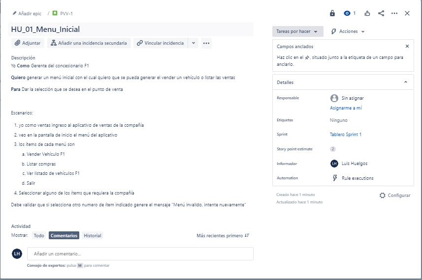
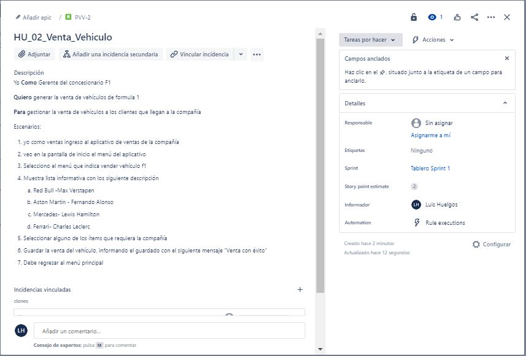
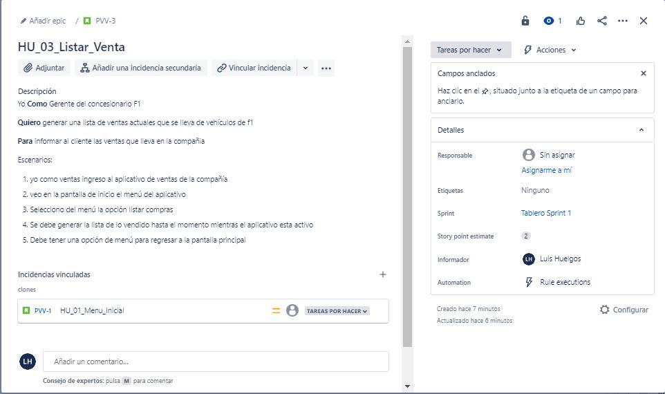
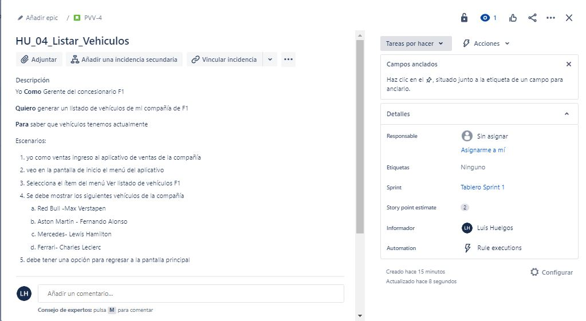

# Ventas de vehiculos F1
## Venta vehiculos
###  En su labor como programador de software es necesaria una aplicación que gestione la venta de vehiculos selectos de la formula 1, donde venda, administre y gestione el inventario de venta de estos vehiculos dando como resultado informes necesarios para la compañia.

> Aclaraciones
+ Se supondra que el aplicativo solo requiere para ver la gestión y administración de una venta de la compañia
+ Para efectos de mantener la simplicidad del ejemplo no se comtemplan manejar persistencia en el almacenamiento de los datos
+ No se realiza valdación, ni se verifica calidad en los dato ingresados
+ No se validara las existencias o compras recurrentes en el aplicativo

## Historia de Usuario
> HU_01_Menu_Inicial

> HU_02_Venta_Vehiculo

> HU_03_Listar_Venta

> HU_04_Listar_Vehiculos

#
##Casos de Uso
